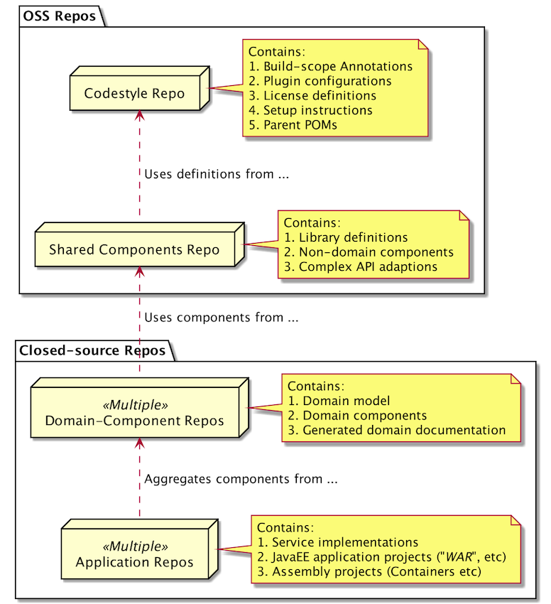

### Build Status:

# What is a "Codestyle" repo?

This repository does not contain artifacts intended for deployment into production.
Instead, this repository contains the `codestyle`, meaning that it contains a versioned 
and rule-set implementation for...

1. **Build reactor definitions**: the common build process, which means implementations of
   build rules for artifacts, plugin configurations and documentation.
2. **Component definitions**: the common module definition, which is used within 
   all normal build reactors within the system.
3. **Parent definitions**: the common parents for use within projects 
   producing artifacts.
   
A `Codestyle` repository, therefore, has no (or few) dependencies on other repositories.
The intended structure and responsibilities of projects/artifacts within repositories could/should
be ordered as illustrated in the image below:

   

## Using the "Codestyle" repo artifacts

The artifacts produced within the Codestyle repository should be used as parents within 
your repositories and artifact projects. Typically, the usage is limited to `parent` 
elements within build reactors, on the following form:

For `Java` artifact projects:

	<!--
    ################################################
    # Section 1:  Project information
    ################################################
    -->
    <parent>
        <groupId>com.etraveli.codestyle.poms.java</groupId>
        <artifactId>etraveli-codestyle-api-parent</artifactId>
        <version>5.2.1</version>
    </parent>
    
For `Kotlin` artifact projects:

	<!--
    ################################################
    # Section 1:  Project information
    ################################################
    -->
    <parent>
        <groupId>com.etraveli.codestyle.poms.kotlin</groupId>
        <artifactId>etraveli-codestyle-api-parent</artifactId>
        <version>5.2.1</version>
    </parent>

... and so on. Each of these parents contain a well-defined    

## Building the "Codestyle" repo

The codestyle repository is built using [Maven](http://maven.apache.org/) and Java 8+.
As with all codestyle-compliant repositories, you should be able to build its artifacts
using a standard Maven build:

	mvn clean install
	
## Building the Documentation

The standard documentation is built using [Maven Site Plugin](https://maven.apache.org/plugins/maven-site-plugin/) 
mechanics - we use [Markdown](https://daringfireball.net/projects/markdown/syntax) with the added capabilities 
of [PlantUML](http://plantuml.com/) diagrams to render diagrams when needed.

This requires you to install a `dot` executable normally found within the [Graphviz](http://graphviz.org) open-source 
application. The section below provides installation instructions.

#### a. Graphviz installation and Dot path setup

To render the documentation graphics, you need to install `Graphviz` and place `dot` in your 
operating system path. In addition, you need to create a globally available Maven property called 
`path.to.dot` within your `$HOME/.m2/settings.xml` file. The property value should contain the 
path to the dot executable, similar to the snippet below: 

    <profiles>

        <!--
            Properties available for all builds.
            Purpose: Contain paths to locally installed applications, or URIs of a semi-secret nature.
        -->
        <profile>
            <id>injected_properties</id>
            <properties>
                <path.to.dot>/usr/bin/dot</path.to.dot>
            </properties>
        </profile>
    </profiles>

    <activeProfiles>
        <activeProfile>injected_properties</activeProfile>        
    </activeProfiles>

With this setup you should be able to properly build the Maven site documentation.

#### b. Building the Documentation

After graphviz/dot is installed, simply build the documentation using:

	mvn site
	
Build the staged documentation for all modules using:

	mvn site site:stage	
	
The staged documentation should land within the `/tmp/${reactor.name}/${version}` directory - typically something like
`/tmp/etraveli_codestyle/1.2.3/`. 

# Release process for Etraveli-Codestyle 

Releasing a stable version of the Etraveli-Codestyle reactor is done in two steps.

## Publishing the Plugin artifacts to Maven Central

The first step of the release process involves building, signing and publishing artifacts to the Sonatype OSS Nexus server.

#### a. Preparing the binary artifact release

Clone the repo and issue the standard maven release preparation, substituting the appropriate values for the 
release version and tag. Semantic versioning applies, so unless you know that the next upcoming version should
contain only documentation changes, let the development version have its minor version number bumped by 1 
(i.e. use `2.5.0` instead of `2.4.1` in the example below). Of course, since the snapshot/development stream may 
contain unexpected changes, the development version is merely an indication of an upcoming version. Issue the
following commands to 

    mkdir rel

    cd rel

    clone ../etraveli-codestyle 

    cd etraveli-codestyle

    mvn -DpushChanges=false -DreleaseVersion=2.4.0 -DdevelopmentVersion=2.5.0-SNAPSHOT -Dtag=etraveli-codestyle-2.4.0 release:prepare
    
If the release preparation build completed without errors, your local release repository should now contain 
two new commits with the commit message starting with `[maven-release-plugin]` on the form shown below. 
We have still not pushed anything to any source code or artifact repository.  

    * b229a34 - Lennart Jörelid (20 seconds ago) (HEAD -> master)
    |   [maven-release-plugin] prepare for next development iteration
    * 31f498f - Lennart Jörelid (20 seconds ago) (tag: etraveli-codestyle-2.4.0)
    |   [maven-release-plugin] prepare release etraveli-codestyle-2.4.0
    * b4499f9 - Lennart Jörelid (9 hours ago) (origin/master, origin/HEAD)
    |   Using only JDK 8 since that is the defaults in travis.
    
#### b. Perform normal deployment of the artifact

Checkout the release tag on the master branch, rebuild and deploy to the OSS repository server.

    git checkout etraveli-codestyle-2.4.0
    
    mvn -Drelease.skipGpgSigning=false -Petraveli-release clean deploy
    
The normal binary release process (send mail to group, solicit acceptance etc.) follows.
When the release is approved, build and publish the release documentation as described below.

## Building the Site documentation

The maven site documentation is mainly synthesized from Markdown resources, combined with 
generated graphics from [PlantUML](http://plantuml.org) and [Dot Graphics](http://graphviz.org).
Both of these graphics delegates graphics rendering to the `Dot` executable.

#### a. Build the release Documentation      

Checkout the newly prepared release and build its artifact and release documentation. 
Note that the system property `https.protocols` is required to generate the site, since
GitHub's api refuses to use the default TLS version of java (i.e. TLSv1.0).

    git checkout etraveli-codestyle-2.4.0
    
    mvn -Dhttps.protocols="TLSv1,TLSv1.1,TLSv1.2" clean package site
    
#### b. Copy the content of the `target/site` directory

The release site documentation is now found within the target/site directory 
of the build. Copy the content of this directory to a temporary place, such as `/tmp`:

    cp -r target/site/* /tmp/
    
#### c. Move the plugin documentation to its gh-pages branch location

Check out the `gh-pages` branch, and copy the documentation to a directory
named `Documentation/v2.4.0` (substitute the version number with the release version).

#### d. Add the documentation to git, and push to publish

Assuming that the repository id is `github`, add the static documentation pages to git, 
commit the addition using a standard message, and push:

    git add Documentation/v2.4.0
    
    git commit -m "Added plugin documentation for version 2.4.0"
    
    git push github 

Following the push, verify that the newly released documentation site is available on github.